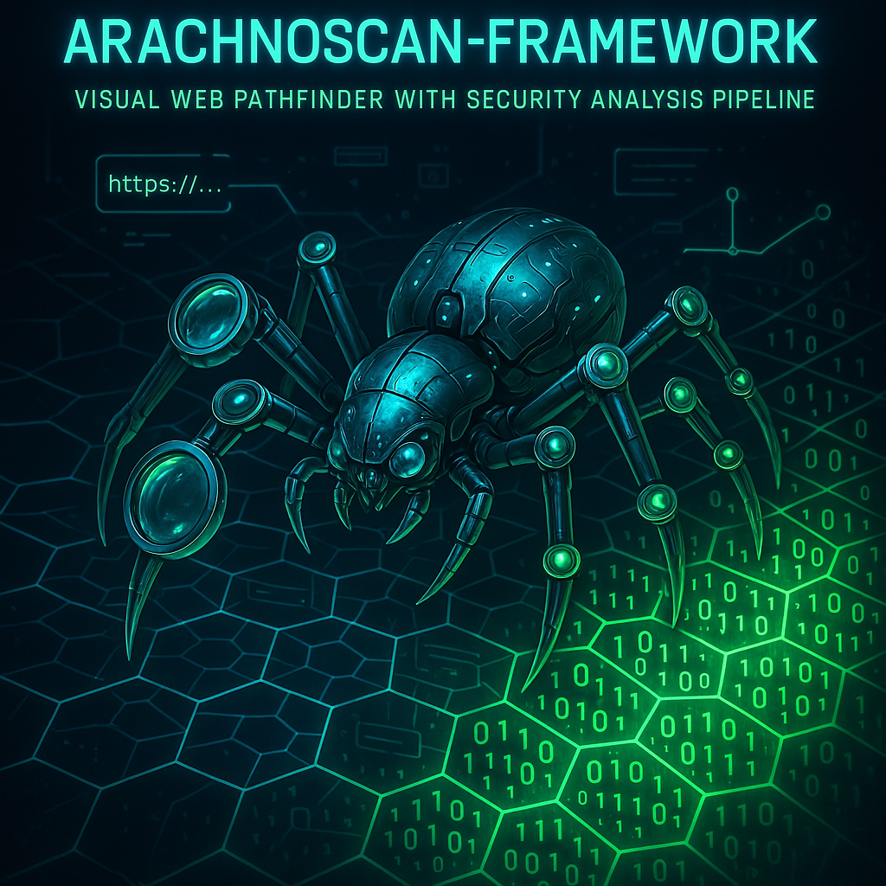
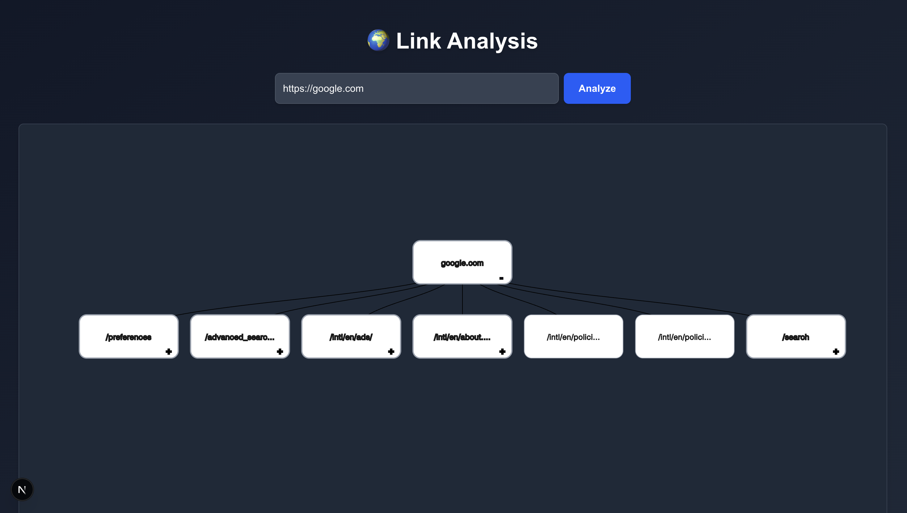
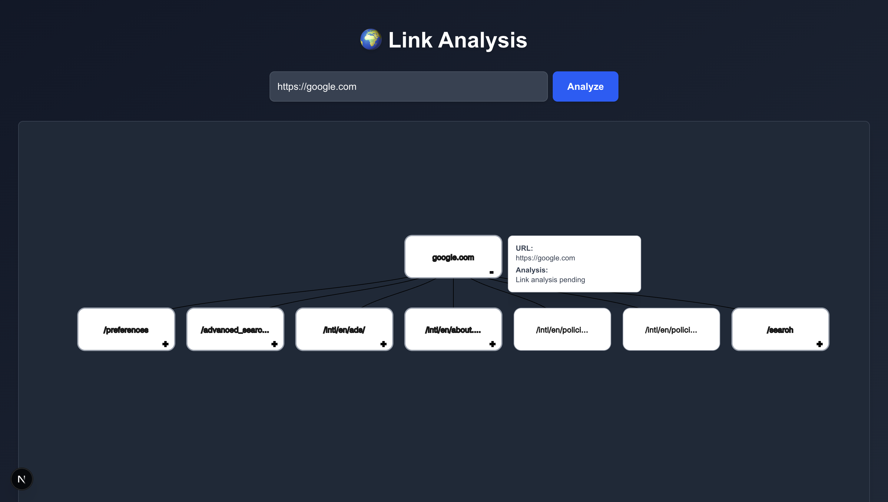
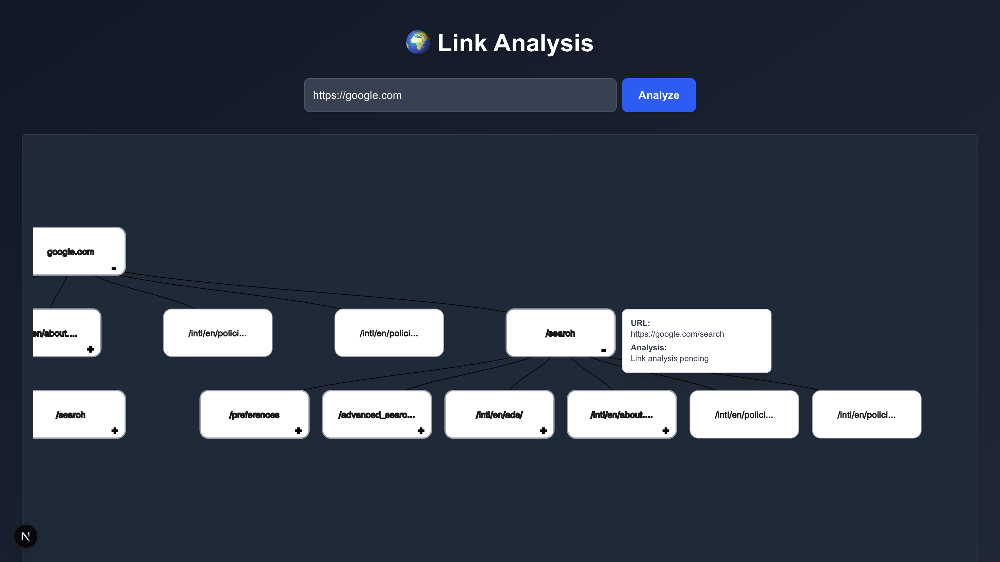
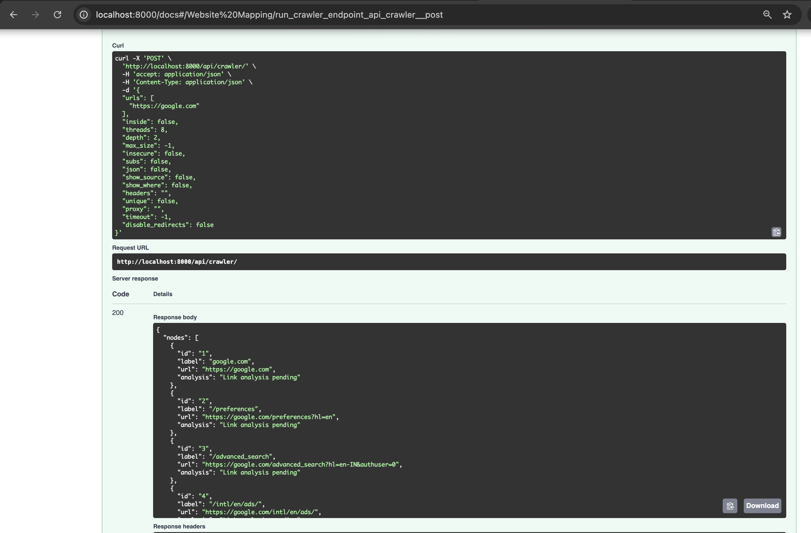

# 🕸️ ArachnoScan Framework

**Map Website Structures | Analyze Security Posture | Open-Source Pen-Testing Toolkit**



---

## Purpose

ArachnoScan crawls websites and renders their URL structures as interactive trees while flagging potential security weak points (analysis pending). Designed as the visualization layer for penetration testing workflows.

```bash
                      ┌──────────────┐
                      │  Target URL  │
                      └──────┬───────┘
                             ▽
                      ┌──────────────┐
                      │ Async Crawler│
                      └──────┬───────┘
                             ▽
                    ┌────────────────────┐
                    │ Tree Visualization │
                    └─────────┬──────────┘
                              ▽
                ┌─────────────────────────────┐
                │ [Future] Security Analysis  │
                └─────────────────────────────┘
```

---

## 🚀 Features

- 🕸️ **Depth-Limited Crawling** (Max Depth 2 - Stability Focused)
- 🌳 **Interactive Tree Visualization** of URL Structures
- ⚡ **Async Python Backend** + Next.js Frontend
- 🔍 **Multi-Source Discovery** (Links/Scripts/Forms)
- 🤖 _[Planned]_ AI agent integration (Attack simulation)
- 🛡️ _[Planned]_ Safety Scoring & Threat Detection

---

## ⚙️ Installation

**Prerequisites**: Python 3.9+, Node.js 18+, npm

### 1. Clone & Setup

```bash
git clone https://github.com/jayeshthk/ArachnoScan-Framework.git
cd ArachnoScan-Framework
```

### 2. Install Dependencies

**Via Makefile**:

```bash
make install  # Installs both UI and API dependencies
```

**Manually**:

```bash
# Backend
cd pen-app && pip install -r requirements.txt

# Frontend
cd pen-ui && npm install
```

---

## 🖥️ Usage

### Start Both Services (Recommended)

```bash
make run  # Parallel execution of UI (port 3000) + API (port 8000)
```

### Individual Start

**Backend Only**:

```bash
cd pen-app && uvicorn app.main:app --reload --host 0.0.0.0 --port 8000
```

**Frontend Only**:

```bash
cd pen-ui && npm run dev
```

---

## 🐳 Docker Deployment

```bash
docker-compose up --build
```

- Frontend: `http://localhost:3000`
- API Docs: `http://localhost:8000/docs`

---

## Limitations

- **Depth-2 Crawling**: Optimized for speed over completeness
- **Early-Stage Analysis**: Security checks marked "pending"
- **No Auth Support**: Public pages only in v0.1
- **Beta Visualization**: Tree rendering may lag for >100 nodes

---

## Future Roadmap

- **Safety Analysis Layer**
  - Malware URL Detection (VirusTotal Integration)
  - SSL/TLS Grading
  - Suspicious Parameter Flagging
- **Performance**
  - Distributed Crawling with Celery
  - Redis Caching
- **Enterprise Features**
  - OAuth/SSO Support
  - PDF/CSV Reporting

---

## Workflow Screenshots

1. Interface with input
   

2. Tree Visualization Interface
   

3. Security Analysis Preview
   

4. Sub-Branching the URL (extend/minimise)
   

5. API Response Example
   

---

## Citations

- Backend Inspiration: [jayeshthk/ArachnoScan0](https://github.com/jayeshthk/ArachnoScan0)
- Research Papers:
  - _"Automated Web Path Discovery for Penetration Testing"_ (IEEE 2023)
  - _"Async Crawling Architectures"_ (ACM Security Journal)

---

## License

MIT License - See 

---

## Contributing

PRs welcome!, for:

- Bug Reports
- Visualization Improvements
- Analysis Module Plugins
